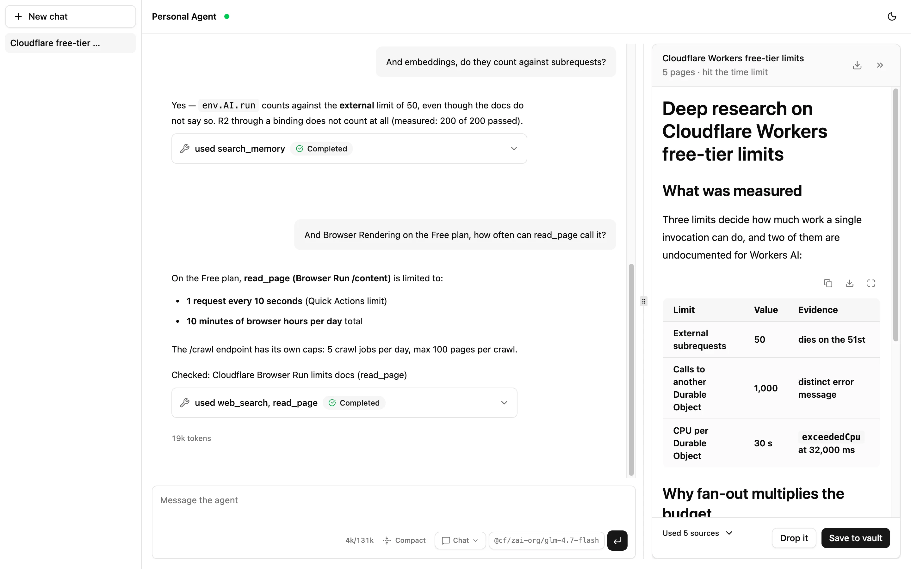
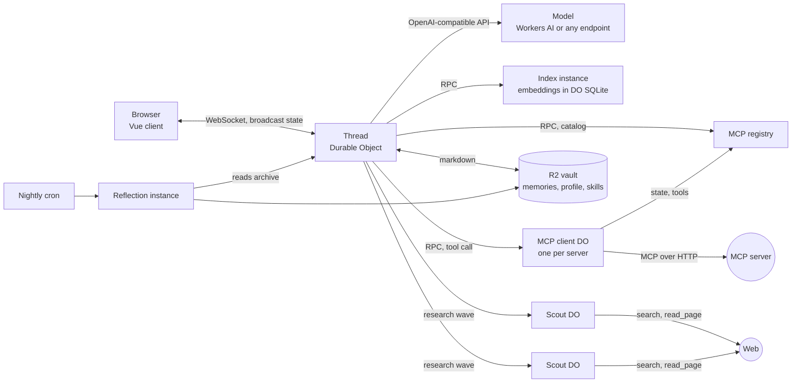

# Personal Agent

[](https://github.com/DomWane/workers-personal-agent/actions/workflows/ci.yml)

A personal AI agent that runs entirely on Cloudflare's free tier. One Durable Object per
conversation, long-term memory as markdown in R2, semantic recall from an embedding index in
Durable Object SQLite, and a deep-research mode that fans out across child Durable Objects. Every
platform limit it runs into is measured and written down.

[](https://deploy.workers.cloudflare.com/?url=https://github.com/DomWane/workers-personal-agent)



## ✨ What's included

- **Web chat** over a WebSocket. The UI holds no state of its own: `setState` in the Durable Object
  persists _and_ broadcasts, so the thread, the research card and the finished report arrive with
  no delivery code.
- **Deep research.** The agent proposes a plan first, then fans out one child Durable Object per
  angle, each with its own fifty subrequests. A wall clock bounds the run, and the report counts
  the pages it could not open.
- **Long-term memory** as markdown in R2, with semantic recall over an embedding index and a keyword
  fallback. Every memory records the turn it came from, and a write that destroys something needs
  a cited user turn.
- **History that compacts** instead of truncating: at 80% of the selected model's context window
  the oldest turns fold into a rolling summary, and go to an append-only archive first.
- **Tool results that outlive their round.** A fetched page is kept whole in the thread's SQLite;
  only the copy inside the request is cut, so a later turn can read the rest.
- **Skills the agent writes for itself.** A workflow that took several tool calls is offered as a
  skill, saved as markdown in the vault, and listed in every system prompt; the model reads the
  procedure when a request matches, and `/slug` invokes one by hand. Unused ones are archived after
  90 days.
- **Scheduled work.** Reminders, recurring tasks, a nightly reflection pass over memory and index
  reconciliation, all Durable Object alarms, none inside a chat turn.
- **Several conversations**, listed in a sidebar and registered in the vault, so a cleared browser
  cannot strand a thread.
- **MCP servers** added in a settings dialog, with OAuth or a bearer token. Their tools are in every
  chat from the next message on.
- **Guards at the boundaries.** Every outbound call goes through a subrequest counter with a
  reserve, and each tool's zod schema is both the JSON Schema the model sees and the parser its
  reply goes through.

**Stack:** Cloudflare Workers, Agents SDK, Durable Objects, R2, Workers AI or any OpenAI-compatible
API, zod, Vue 3, Vite, Tailwind, shadcn-vue, vitest.

## 🚀 Quick start

**With the button.** Cloudflare clones this repository into your GitHub account, creates the R2
bucket, the Durable Objects and the Workers AI binding from `wrangler.jsonc`, asks for the secrets
listed in `.env.example`, and redeploys on every push. In the same flow turn on **Protect with
Cloudflare Access** for **All traffic** and add a policy with your email. One-time PIN needs no
identity provider.

**From the command line.**

```bash
pnpm install
pnpm wrangler login
pnpm wrangler r2 bucket create personal-agent-vault
pnpm wrangler secret put CF_ACCOUNT_ID
pnpm wrangler secret put CF_API_TOKEN
pnpm run deploy
```

Then switch Access on in the Worker's **Access** tab and reload. A deploy with no Access in front
answers `503` and says so, because a connected client receives the whole broadcast state and the
Worker refuses to open your vault to whoever finds the URL. What was measured about Access and
WebSockets, and how to run it open on purpose, is in
[ARCHITECTURE.md](ARCHITECTURE.md#deploying-this).

The committed config runs on Workers AI and searches keyless, so nothing else is needed. Another
provider is one var and one secret, see Configuration.

## 💬 Try it

- **"What changed in the Workers Agents SDK this month?"** — `web_search` and `read_page`, with a
  `Checked:` line under the answer naming the sources.
- **"Remember that I write my notes in Czech."** — `save_memory`, or the profile when a fact changes
  the shape of most answers.
- **"Remind me at nine tomorrow to send the invoice."** — a Durable Object alarm.
- **"Save that as a skill called Daily digest"** after a search-and-summarise turn — `save_skill`.
  Next time, "give me the daily digest" or `/daily-digest` follows the saved procedure.
- **Toggle Deep research in the composer and type a topic** — a plan card with Start, Revise and
  Drop, then a status card that updates as the scouts work.
- **"What did that article say about pricing?"** — `search_tool_results` over the pages this thread
  already fetched, no network request.
- **Open Settings, add `https://mcp.cloudflare.com/mcp` and sign in, then ask about your Workers** —
  the server's tools are called as `cloudflare_<tool>` in the next turn.

## 🧭 How it works



One Durable Object per thread runs the tool loop. The index instance, the scouts and the MCP clients
each spend a budget of their own, and a thread reaches them by RPC, which costs no external
subrequest. The full picture is [ARCHITECTURE.md](ARCHITECTURE.md); the rejected alternative behind
each subsystem is in [docs/decisions/](docs/decisions/).

## ⚙️ Configuration

### Model provider

| `LLM_BASE_URL` | What happens                                                                                           |
| :------------- | :----------------------------------------------------------------------------------------------------- |
| unset          | **Workers AI**, derived from `CF_ACCOUNT_ID` and authenticated with `CF_API_TOKEN`. Nothing else to set. |
| set            | That endpoint, authenticated with `LLM_API_KEY`: OpenRouter, OpenAI, Groq, a local Ollama, any OpenAI shape. |

The picker in the UI reads the provider's own catalogue and shows price, context window and tool
support per model. **Tool calling is not optional**: the agent is a tool loop. Verified on the Free
plan: `@cf/zai-org/glm-4.7-flash`, `@cf/openai/gpt-oss-120b`, `@cf/qwen/qwen3-30b-a3b-fp8`,
`@cf/meta/llama-3.3-70b-instruct-fp8-fast`. A warning sign by the model name means `LLM_MODEL` is
not in the catalogue, almost always a typo.

### Secrets

Locally in `.env`; in production with `pnpm wrangler secret put <NAME>`.

| Secret              | Needed for                                                                                                                                                        |
| :------------------ | :---------------------------------------------------------------------------------------------------------------------------------------------------------------- |
| `CF_ACCOUNT_ID`     | The account the calls go to.                                                                                                                                      |
| `CF_API_TOKEN`      | **Workers AI: Read** (catalogue and chat), **Browser Rendering: Edit** (`read_page`), **Billing: Read** (the plan lookup that sizes the subrequest budget). |
| `LLM_API_KEY`       | Only with `LLM_BASE_URL` set.                                                                                                                                     |
| `TAVILY_API_KEY`    | Optional. Keyless without it; a key raises the rate limit to 100 a minute.                                                                                        |
| `FIRECRAWL_API_KEY` | Optional. The second search vendor and the `read_page` fallback, keyless at 1,000 credits a month.                                                                |

### Vars

Set in `wrangler.jsonc`.

| Var                                | Default                     | What it does                                                                                             |
| :--------------------------------- | :-------------------------- | :------------------------------------------------------------------------------------------------------- |
| `LLM_MODEL`                        | `@cf/zai-org/glm-4.7-flash` | The model that answers unless the picker overrides it per thread.                                        |
| `ENVIRONMENT`                      | `production`                | `localhost` opens the Access gate and the dev routes. The embedding index runs only under `production`. |
| `VAULT_AGENT_DIR`                  | `agent`                     | Key prefix inside the R2 bucket.                                                                         |
| `LOG_CONTENT`                      | `"true"`                    | Puts message bodies and tool results into the logs for the three days Workers Logs keeps them.           |
| `SCOUT_MODEL`, `REFLECTION_MODEL`  | unset                       | Cheaper models for the research wave and the nightly pass; add to `vars` when wanted.                    |
| `ALLOW_UNPROTECTED`                | unset                       | `true` serves with no Cloudflare Access in front, and logs it on every request.                          |

## 📉 Free plan limits

| Limit                           | Free plan                        | When it bites                       | What the agent does                                           |
| :------------------------------ | :------------------------------- | :---------------------------------- | :------------------------------------------------------------ |
| External subrequests per invocation | 50                           | a turn with many tool calls, a research round | counts every call and stops before the 51st, saying so |
| Browser Rendering (`read_page`) | 1 request / 10 s, 10 min a day   | a research wave                     | falls back to Firecrawl; the report counts pages it could not open |
| Workers AI                      | 10,000 neurons a day             | a deep research run on the default model | the provider answers 429 and the turn is reported as failed |
| Search without a key            | Tavily unpublished · Firecrawl 1,000 credits a month | a research run with no search secret | a refused search is a tool fault, never an empty web |

A chat turn never meets any of these. Deep research meets the first three on every run and is built
to finish anyway: on the run in [the walkthrough](docs/manual-e2e.md) it lost 14 of 30 page reads to
the Browser Rendering limit, completed, and said so. The full table, with how each number was
measured, is in [ARCHITECTURE.md](ARCHITECTURE.md#platform-limits-and-which-of-them-were-measured).

## 🛠 Development

```bash
cp .env.example .env               # fill in the values under Configuration
echo ENVIRONMENT=localhost >> .env
pnpm dev                           # wrangler dev on http://localhost:8787
pnpm dev:web                       # Vite with hot reload, proxied to 8787
```

```bash
pnpm check && pnpm check:web && pnpm lint && pnpm format:check
pnpm test                          # agent suite in the Workers pool, no network
pnpm test:evals                    # retrieval evals, Node pool
```

`ENVIRONMENT=localhost` opens two dev-only routes and a seed script that fills a thread without
model calls:

```bash
curl -s localhost:8787/dev/chat -d '{"text":"hi","thread":"t1"}'
node scripts/seed-web-chat.mjs --phase done        # or: proposed, running
```

[docs/manual-e2e.md](docs/manual-e2e.md) is the walkthrough for the seams no suite covers.
[AGENTS.md](AGENTS.md) is the working file for the coding agent this was built with: commands,
test traps, and why `wrangler dev` needs `cloudflared` once Access is on the account.

### Project structure

```
src/
  index.ts                 Worker: routing, the Access gate, the model catalogue
  agent/
    personal-agent.ts      one Durable Object per thread
    maintenance-agent.ts   the embedding index and the nightly reflection
    loop/                  the tool loop, context-window arithmetic, compaction
    research/              proposal, wave of scouts, rounds, report
    mcp/                   MCP servers as Durable Objects, their tool catalog
    memory/                R2 vault, markdown format, embedding index
    tools/                 one file per tool family, zod schemas
  types/                   state and wire shapes, shared with the web client
  connectors/              LLM, Tavily, Firecrawl, Browser Rendering, R2
web/src/                   Vue 3 client, shadcn-vue and ai-elements-vue components
evals/                     retrieval and prompt evals, own vitest pool
docs/                      decisions, measurements, the manual walkthrough
```

## 🔬 What's interesting here

- **[Choosing a retriever by measuring it](docs/retrieval-eval.md):** 673 real exchanges, graded
  relevance, pooled judgments. Dense retrieval (`bge-m3`) beats BM25 by **+0.200 nDCG@10
  [0.070, 0.326]**.
- **[Does ThinkingCap's token saving hold in Czech, over real work?](docs/thinkingcap-replication.md):**
  an independent replication off the benchmark the claim was made on. The saving holds at
  **50.8% [43.2%, 57.7%]**; the capability half is underpowered, and the write-up says so.
- **[The walkthrough for the seams no suite covers](docs/manual-e2e.md):** the DOM, and the socket
  between the built client and a live Worker. It opens with the three bugs found by hand that no
  unit test could have failed.

Both write-ups carry a section on how the measurement was wrong before it was right.
[evals/README.md](evals/README.md) indexes every eval, and most say no: hybrid fusion, a reranker, a
larger ingest window and averaged word vectors were each tested and rejected, two against a
prediction written down beforehand.

## 🩺 Troubleshooting

- **The UI loads but nothing answers.** Check `wrangler tail`. A 401 from the provider is the
  credential: `CF_API_TOKEN` without Workers AI: Read, or a missing `LLM_API_KEY` with
  `LLM_BASE_URL` set. An empty picker usually means the same credential cannot read the catalogue.
- **`read_page` keeps falling back.** Browser Rendering on the Free plan allows one request every
  ten seconds, and a research wave outruns it. The log line carries `why`.
- **Firecrawl answers `403` under `wrangler dev` with no key.** Keyless access is gated on the
  caller's IP; the deployed Worker calls from Cloudflare's egress and is accepted. A key in `.env`
  lifts it locally.
- **A deploy seems to have had no effect.** A live Durable Object keeps its old code until the
  instance restarts, about five minutes when measured.
- **A route answers with HTML instead of JSON.** The path is missing from `run_worker_first` in
  `wrangler.jsonc`, so the asset server served the SPA shell.

## 🙏 Acknowledgements

Designs borrowed, with what was taken from each: [deepseek-harness](https://github.com/deepseek-ai/deepseek-harness)
(the compaction threshold and the archive-before-trim record), [hermes-agent](https://github.com/NousResearch/hermes-agent)
(dropping half-paired tool traffic), [openclaw](https://docs.openclaw.ai) and
[gemini-cli](https://github.com/google-gemini/gemini-cli) (tool-result caps compared against ours),
[Static-DRA](https://arxiv.org/abs/2512.03887) (the narrowing of a research wave). No code was
copied from any of them. The papers behind the memory gate, the pruner and the citation check are
cited where they are used, in [docs/decisions/](docs/decisions/) and [evals/README.md](evals/README.md).

## Licence

MIT, see [LICENSE](LICENSE). `web/src/components/` holds source copied from shadcn-vue (MIT) and
ai-elements-vue (Apache-2.0); those files keep the licence they arrived under, and
[NOTICE.md](NOTICE.md) carries the attribution.
