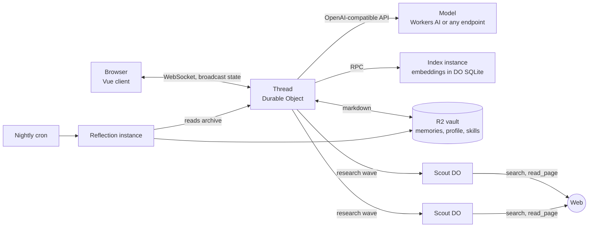

# Personal Agent — a web chat agent on Cloudflare Workers

[](https://github.com/DomWane/workers-personal-agent/actions/workflows/ci.yml)

A personal AI agent hosted entirely on Cloudflare's free tier. One Durable Object per conversation,
long-term memory as markdown in R2, semantic recall from an embedding index in DO SQLite, and a
deep-research mode that fans out across child Durable Objects. Every platform limit it runs into is
measured and written down.

[](https://deploy.workers.cloudflare.com/?url=https://github.com/DomWane/workers-personal-agent)


**What you need**

- A Cloudflare account. The free plan is enough.
- Cloudflare Access in front of the Worker — free, two minutes, [explained below](#before-you-deploy-cloudflare-access).
- A model. The committed config uses Workers AI (`@cf/zai-org/glm-4.7-flash`, 131k context), so
  there is nothing else to set up. Any OpenAI-compatible endpoint is one var and one secret away.

Web search runs keyless on Tavily and Firecrawl; a key for either only raises its rate limit.

**Stack:** Cloudflare Workers, Agents SDK, Durable Objects, R2, Workers AI or any OpenAI-compatible
API, zod, Vue 3 + Vite + Tailwind + shadcn-vue, pnpm, wrangler v4, vitest, oxlint + oxfmt.

---

## Before you deploy: Cloudflare Access

A connected client receives the whole broadcast state: the conversation, the user profile, the
agent's notes, finished research reports. That is fine for one user, which is what this is built for.
It also means the Worker **refuses to serve until Cloudflare Access is in front of it** — a fresh
deploy answers `503` with instructions instead of opening your vault to whoever finds the URL.

Setting it up:

1. Cloudflare dashboard → Zero Trust → Access controls → Applications → Add → **Self-hosted**.
2. Pick the **Workers** destination and this Worker. That covers `*.workers.dev` and any custom
   domain.
3. Add a policy allowing your email. One-time PIN works without an identity provider.

Two rules that are not preferences:

- It has to be the **self-hosted** kind. A Worker-level Access policy rejects WebSocket upgrades with
  a 403, and this chat is a WebSocket.
- **Every hostname routed to this Worker has to be in the application**, preview URLs included. The
  Worker only checks that the `Cf-Access-Jwt-Assertion` header is present, which is exactly as good
  as the hostnames Access covers.

To run it open on purpose, set the var `ALLOW_UNPROTECTED=true`. It serves and logs
`at: "access", stage: "unprotected"` on every request. The gate is off only when `ENVIRONMENT` is
exactly `localhost`; `staging` or a typo is a deployment and stays closed.

---

## Deploying

**With the button.** Cloudflare clones this repository into your GitHub account, creates the R2
bucket, the Durable Objects and the Workers AI binding from `wrangler.jsonc`, asks for the secrets
listed in `.env.example`, and redeploys on every push to your copy. The build command it
pre-fills is the `build` script in `package.json`, which compiles the Vue client; leave it in place.

**From the command line.**

```bash
pnpm install
pnpm wrangler login
pnpm wrangler r2 bucket create personal-agent-vault   # the bucket named in wrangler.jsonc, once
pnpm wrangler secret put CF_ACCOUNT_ID
pnpm wrangler secret put CF_API_TOKEN
pnpm wrangler secret put LLM_API_KEY                   # only with LLM_BASE_URL set
pnpm run deploy         # `run` matters: bare `pnpm deploy` is pnpm's own command, not this script
```

Either way, the first deploy opens on a page that says the agent is closed and lists the three
Access steps above. Do them, reload, and the chat is there. What each secret is for is under
[Configuration](#configuration).

---

## Local development

```bash
pnpm install
cp .env.example .env                  # fill in the values under Configuration
echo ENVIRONMENT=localhost >> .env    # opens the Access gate for wrangler dev only
pnpm dev                              # wrangler dev on http://localhost:8787, builds the client first
```

Open `http://localhost:8787`. `pnpm dev:web` runs Vite separately with hot reload, proxying
`/agents` and `/api` to the Worker on 8787 — useful while working on the UI.

`ENVIRONMENT=localhost` also opens two dev-only routes:

```bash
# Chat synchronously, no UI involved
curl -s localhost:8787/dev/chat -d '{"text":"hi","thread":"t1"}'

# Fill the web agent with a conversation that exercises every part of the UI
node scripts/seed-web-chat.mjs --phase done      # or: proposed, running
```

**Once Access is on the account, `wrangler dev` needs `cloudflared` and a real terminal.** The `ai`
binding has no local simulator, so dev opens a remote proxy session against the deployed Worker, and
Access gates it. Install `cloudflared` once and let wrangler send you to the Access login. Do not
pipe dev through `tee`: that makes it non-interactive, and the failure then complains about missing
service-token credentials rather than about the missing terminal.

### Checks and tests

```bash
pnpm check        # tsc over src/ and test/
pnpm check:web    # vue-tsc over web/
pnpm test         # agent suite, Workers pool
pnpm check:evals  # evals/ has its own tsconfig — it runs on Node, not Workers
pnpm test:evals   # and its own pool; neither command runs the other's tests
pnpm lint         # oxlint, including type-aware rules
pnpm format       # oxfmt; format:check is the read-only form
```

Tests use miniflare bindings and need no network: R2 is simulated locally, outbound HTTP is
intercepted. `pnpm lint` runs typescript-eslint's type-aware rules through `oxlint-tsgolint` on
TypeScript 5.9, although the oxc docs say 7 — the comparison, and why 7 is blocked by `vue-tsc`, is in
[docs/decisions/linting-and-formatting.md](docs/decisions/linting-and-formatting.md).

---

## Configuration

### The model provider

The agent talks to any OpenAI-compatible API. One variable decides which:

| `LLM_BASE_URL` | What happens |
| :--- | :--- |
| unset | **Cloudflare Workers AI**, derived from `CF_ACCOUNT_ID`, authenticated with `CF_API_TOKEN`. Nothing else to configure. |
| set | That endpoint, authenticated with `LLM_API_KEY`. OpenRouter, OpenAI, Together, Groq, a local Ollama — anything speaking the OpenAI shape. |

The model picker in the UI reads the provider's own catalogue and shows, per model, price per
million tokens, context window, and whether it supports tool calling. Models the deployment cannot
call are listed greyed out rather than hidden.

**Tool calling is not optional.** The agent is a tool loop; a model without it cannot search, read,
or remember. Four Workers AI models were verified to return proper `tool_calls` on the Free plan:
`@cf/zai-org/glm-4.7-flash`, `@cf/openai/gpt-oss-120b`, `@cf/qwen/qwen3-30b-a3b-fp8` and
`@cf/meta/llama-3.3-70b-instruct-fp8-fast`.

### Secrets

Set locally in `.env`, which `wrangler dev` and the `eval:*` scripts both read; in production with
`pnpm wrangler secret put <NAME>`.

| Secret | Needed for |
| :--- | :--- |
| `CF_ACCOUNT_ID` | The account the calls below go to. |
| `CF_API_TOKEN` | One token with **Workers AI: Read** (catalogue and, by default, chat), **Browser Rendering: Edit** (`read_page`) and **Billing: Read** (the hourly plan lookup that sizes the subrequest budget; without it the lookup assumes the Free plan's 50). Add **Account Analytics: Read** only for `pnpm eval:traces`. |
| `LLM_API_KEY` | Only when `LLM_BASE_URL` points somewhere other than Cloudflare. Not in `.env.example`, so the button never asks for it. |
| `TAVILY_API_KEY` | Optional. Search runs keyless without it at a rate limit Tavily does not publish; with a key, 100 requests a minute. Tavily leads the chain. |
| `FIRECRAWL_API_KEY` | Optional. The second search vendor and the `read_page` fallback, keyless at 1,000 credits a month. |

### Vars

Set in `wrangler.jsonc`.

| Var | Default | What it does |
| :--- | :--- | :--- |
| `LLM_BASE_URL` | unset | Unset means Workers AI and a `@cf/` id in `LLM_MODEL`. Set it to any OpenAI-compatible endpoint, with its key in `LLM_API_KEY`. |
| `LLM_MODEL` | `@cf/zai-org/glm-4.7-flash` | The model that answers when nothing overrides it; the picker in the UI overrides it per thread. |
| `ENVIRONMENT` | `production` | `localhost` opens the Access gate and the dev routes. Nothing else is meaningful; the embedding index runs only under `production`. |
| `VAULT_AGENT_DIR` | `agent` | Key prefix inside the R2 bucket the memory lives in. |
| `LOG_CONTENT` | `"true"` | **An opinion, not a neutral default.** Puts message bodies, tool arguments and tool results into the logs for the three days Workers Logs keeps them. Anything but `"true"` or `"1"` turns it off. |
| `SCOUT_MODEL`, `REFLECTION_MODEL` | unset | A research wave is where the tokens go and the nightly pass runs unattended, so these are the two places worth pointing at something cheaper than `LLM_MODEL`. |
| `ALLOW_UNPROTECTED` | unset | `true` serves with no Cloudflare Access in front, and logs it on every request. |

`SCOUT_MODEL`, `REFLECTION_MODEL` and `ALLOW_UNPROTECTED` are not in the committed file; add them to
`vars` when wanted.

---

## Routes

| Route | What it does |
| :--- | :--- |
| `GET /` | The chat UI, served from `./public` |
| `/agents/personal-agent/*` | WebSocket and RPC for the agent; the DO name is rewritten server-side so a client cannot address someone else's conversation |
| `GET /api/models` | The provider's model catalogue, proxied and cached for an hour |
| `GET /api/threads` | The conversation list, read from the vault |
| `POST /admin/reindex` | Forces the nightly index reconcile |
| `POST /dev/chat`, `POST /dev/seed` | Localhost only |

None of them has a gate of its own: in production they all answer `503` until Access is in front,
unless `ALLOW_UNPROTECTED` says otherwise. The SPA shell is the exception, because static assets are
served without running the Worker; it carries no data and cannot connect to anything.

`run_worker_first` in `wrangler.jsonc` lists every non-UI prefix. Without it the asset server answers
them with the SPA shell and the Worker never sees the request.

---

## What it does



**Web chat.** Messages, markdown, per-message tool usage, and a research panel that updates as the
run goes. The UI holds no state of its own: `setState` in the Durable Object persists *and*
broadcasts, so the thread, the status card and the finished report arrive without a line of delivery
code.

**Deep research.** A mode in the composer. The agent proposes a plan first, because a run costs
minutes and hundreds of requests; then it works in rounds. A round with more than one angle fans out
into one child Durable Object per angle, each with its own fifty subrequests and thirty seconds of
CPU. A five-minute wall clock bounds the run, with the headroom for the last round measured rather
than assumed.

**Long-term memory.** Markdown in R2, with semantic recall over an embedding index in DO SQLite and
a keyword path as fallback. The index is derived data keyed by the R2 etag, so an unchanged vault
reconciles at zero cost. Every memory records the thread and turn it came from, and the two writes
that destroy something — archiving a memory, rewriting a profile line — need a cited user turn that
is checked against the conversation holding it.

**History that compacts instead of truncating.** At 80% of the *selected model's* context window an
alarm folds the oldest turns into a rolling summary, keeping a verbatim tail of 25%. A message count
cannot express that threshold when the picker switches between a 24k and a 131k model
mid-conversation. What compaction evicts goes into an append-only archive in the thread's own SQLite
first, so it is shadowed rather than lost.

**Tool results that outlive their round.** A fetched page is kept whole in the thread's SQLite and
only the copy inside the request is cut, so `read_tool_result` reaches the rest and
`search_tool_results` finds it a dozen turns later. How much survives into the request is a fraction
of the model's own window, not a fixed number.

**Scheduled work.** Reminders, recurring agentic tasks, a nightly reflection pass that curates
memory, and index reconciliation — all Durable Object alarms, never inside a chat turn. An unbounded
sweep inside a turn is what caused this project's one outage.

**Several conversations.** One Durable Object per thread, listed in a sidebar and registered in the
vault rather than in `localStorage`, because a cleared browser store would otherwise leave threads
alive and unreachable.

**Guards at the boundaries.** Every outbound call goes through a subrequest counter with a reserve,
so a turn that runs out of room still answers. Each tool's zod schema is both the JSON Schema the
model is shown and the parser its reply goes through, so the advertised contract and the enforced
one cannot drift.

---

## Limits on the free tier

The Cloudflare side runs on Workers Free. These are the ceilings a fresh deploy meets, what the
agent does when it meets them, and what lifts each one. The full table, with how each number was
measured, is in [ARCHITECTURE.md](ARCHITECTURE.md).

| Limit | Free plan | When it bites | What the agent does | What lifts it |
| :--- | :--- | :--- | :--- | :--- |
| External subrequests per invocation | 50 | a chat turn with many tool calls; a research round | counts every call against a budget and stops the loop before the 51st, saying so | Workers Paid: 10,000 |
| Browser Rendering (`read_page`) | 1 request / 10 s, 10 min of browser time a day | a research wave — a single round outruns it | falls back to Firecrawl and logs `why`; the report counts pages it could not open | Workers Paid |
| Workers AI | 10,000 neurons a day | a deep research run on the default model | the provider answers 429 and the turn is reported as failed | Workers Paid, or `LLM_BASE_URL` pointed elsewhere |
| Web search without a key | Tavily: rate-limited, number unpublished · Firecrawl: 1,000 credits a month | a research run on a deploy with no search secret | a refused search is reported as a tool fault, never as an empty web | `TAVILY_API_KEY`: 100 requests a minute · `FIRECRAWL_API_KEY`: 10 a minute |
| Durable Object CPU | 30 s per request | far beyond anything here; brute-force cosine over the vault is milliseconds | — | — |

A chat turn never meets any of these. Deep research meets the first three on every run and is built
to finish anyway: on the run in [the walkthrough](docs/manual-e2e.md) it lost 14 of 30 page reads to
the Browser Rendering limit, completed, and said so in the report.

---

## What's interesting here

The measurements. Two write-ups, each settling a question with data, and one walkthrough:

- **[Choosing a retriever by measuring it](docs/retrieval-eval.md)** — 673 real exchanges, graded
  relevance, pooled judgments. Dense retrieval (`bge-m3`) beats BM25 by **+0.200 nDCG@10
  [0.070, 0.326]**. Hybrid fusion and a cross-encoder reranker were both tested and rejected.
- **[Does ThinkingCap's token saving hold in Czech, over real work?](docs/thinkingcap-replication.md)**
  — an independent replication off the benchmark suite the claim was made on. The saving holds at
  **50.8% [43.2%, 57.7%]**; the capability half is underpowered, and the write-up says so.
- **[The walkthrough for the seams no suite covers](docs/manual-e2e.md)** — the DOM, and the socket
  between the built client and a live Worker. It opens with the three bugs found by hand that no
  unit test could have failed.

Both write-ups carry a section on how the measurement was wrong before it was right. Those sections
are the point, not an appendix. [The full index](evals/README.md) holds every eval, and most say no:
hybrid fusion, a reranker, a larger ingest window and averaged word vectors were each tested and
rejected, two against a prediction written down beforehand. The negative results are kept in full.

[`ARCHITECTURE.md`](ARCHITECTURE.md) carries the same habit for the platform: every number in its
tables says how it is known — measured, with the date, or documented. [`docs/decisions/`](docs/decisions/)
holds the rejected alternative behind each subsystem. `AGENTS.md` is the working file for the coding
agent this was built with; the architecture was split out of it so a person and an agent can each
read their half.

---

## Troubleshooting

**The UI loads but nothing answers.** Check `wrangler tail`. A 401 from the provider is the
credential: `CF_API_TOKEN` without Workers AI: Read on the default, or a missing `LLM_API_KEY` with
`LLM_BASE_URL` set. An empty model picker usually means the same credential cannot read the
catalogue.

**`read_page` keeps falling back.** Browser Rendering on the Free plan allows one request every ten
seconds, and a research wave outruns that in its first round. The log line carries `why`.

**Firecrawl answers `403` under `wrangler dev` with no key.** Keyless access is gated on the
caller's IP reputation, and `wrangler dev` calls out from your own connection; some ISPs and VPNs are
refused with "your IP address looks suspicious". The deployed Worker calls from Cloudflare's egress,
which was accepted when checked. A `FIRECRAWL_API_KEY` in `.env` lifts it locally.

**A deploy seems to have had no effect.** A live Durable Object keeps running its old code until the
instance restarts — about five minutes, measured once. Wait before doubting the change.

**A route answers with HTML instead of JSON.** The path is missing from `run_worker_first`, so the
asset server served the SPA shell and the Worker never saw it.

---

## Acknowledgements

Designs borrowed, with what was taken from each:

- **[deepseek-harness](https://github.com/deepseek-ai/deepseek-harness)** — the compaction
  threshold (`dsh-compaction-basic`'s 0.80), writing the archive record before the trim, and the
  start/end rows that make an abandoned compaction detectable.
- **[hermes-agent](https://github.com/NousResearch/hermes-agent)** — dropping half-paired tool
  traffic before it reaches a strict provider.
- **[openclaw](https://docs.openclaw.ai)** and **[gemini-cli](https://github.com/google-gemini/gemini-cli)**
  — the two harnesses whose tool-result caps were compared against `RESULT_SHARE_OF_WINDOW` before
  it was kept.
- **[Static-DRA](https://arxiv.org/abs/2512.03887)** — the `max(b - 2i, 1)` narrowing of a
  research wave.

No code was copied from any of them.

Papers, with the decision each one carries:

- **Lindenbauer et al., [arXiv 2508.21433](https://arxiv.org/abs/2508.21433)** — replacing stale
  observations with a placeholder halves an agent's cost at the same solve rate; why the pruner
  stubs a result the model has already answered on.
- **Zhang et al., [arXiv 2606.00408](https://arxiv.org/abs/2606.00408)** — an append-only page pool
  the model can re-open, and attention on observations front-loaded; why every cut keeps a head, a
  tail and a ref back.
- **Huang et al., ICLR 2024, [arXiv 2310.01798](https://arxiv.org/abs/2310.01798)** — unaided
  self-correction makes reasoning worse; why a memory write that destroys something needs a cited
  user turn.
- **DeepHalluBench, [arXiv 2601.22984](https://arxiv.org/abs/2601.22984)** — an invented source is
  invisible to end-to-end evaluation; why ungrounded citations are logged rather than trusted.
- **NoLiMa, [arXiv 2502.05167](https://arxiv.org/abs/2502.05167)** and **LineRetriever,
  [arXiv 2507.00210](https://arxiv.org/abs/2507.00210)** — how far a model's usable context falls
  short of its window; the ground for the page-size preregistration in `evals/results/`.

Each is discussed where it is used, in [docs/decisions/](docs/decisions/) and
[evals/README.md](evals/README.md).

## Licence

MIT — see [LICENSE](LICENSE).

`web/src/components/` holds source copied from shadcn-vue (MIT) and ai-elements-vue (Apache-2.0),
both copy-paste registries whose CLI writes into the project rather than into `node_modules`. Those
files keep the licence they arrived under; [NOTICE.md](NOTICE.md) carries the attribution.
